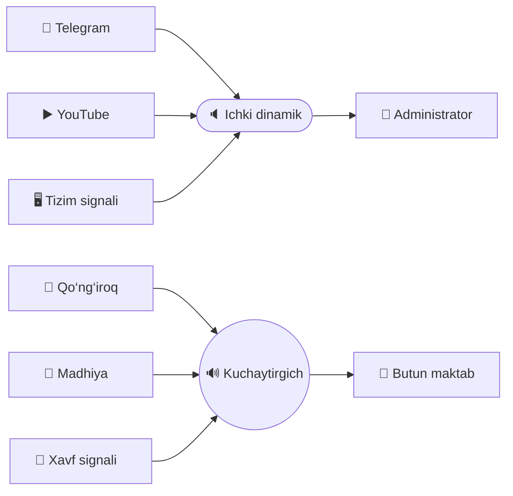
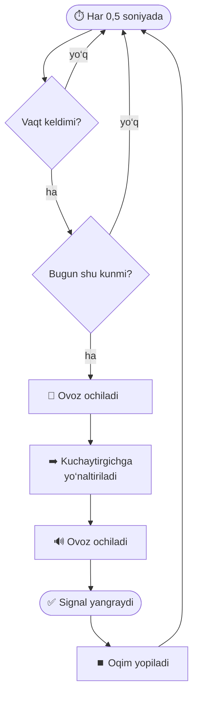
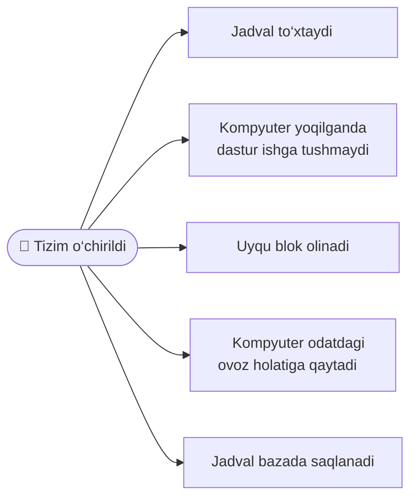

```mermaid
gantt
    title Namuna jadval
    dateFormat HH:mm
    axisFormat %H:%M

    section 1-smena
    1-dars      :done, 08:00, 45m
    2-dars      :done, 08:55, 45m
    3-dars      :done, 09:50, 45m
    Tanaffus    :active, 10:35, 20m
    4-dars      :done, 10:55, 45m

    section 2-smena
    5-dars      :done, 13:00, 45m
    6-dars      :done, 13:55, 45m
    7-dars      :done, 14:50, 45m
```

# 🔔 Maktab Qo‘ng‘irog‘i

### Maktab signallarini boshqaruvchi ish stoli dasturi

<table width="100%">
<tr>
<td width="25%" align="center">

### ⏰

**Jadval**

Istalgancha vaqt.
Har biriga hafta kunlari
alohida belgilanadi.
</td>
<td width="25%" align="center">

### 🔊

**Aniq manzil**

Signal kuchaytirgichga,
kompyuter ovozi esa
o‘z dinamigida qoladi.
</td>
<td width="25%" align="center">

### 🌙

**To‘xtamaydi**

Uyquni bloklaydi,
qulflangan ekranda ham
o‘z vaqtida chalinadi.
</td>
<td width="25%" align="center">

### 📌

**Yengil**

Bo‘sh turganda 0,5 %
protsessor, diskka
umuman yozmaydi.
</td>
</tr>
</table>

---

---

---

---

---

<table width="100%">
<tr>
<td width="50%" align="center">

### 📋 Jadval

Chap tomonda qo‘ng‘iroqlar ro‘yxati.
Keyingi signalgacha qolgan vaqt doim ko‘rinib turadi.

</td>
<td width="50%" align="center">

### 🕐 Vaqt tanlash

Soat va daqiqa sichqoncha g‘ildiragi bilan aylantiriladi.

</td>
</tr>
<tr>
<td width="50%" align="center">

### 🔒 Qulf

Tahrirlash qismi qulflangan turadi.
Administrator qulfni ochib vaqtni o‘zgartiradi.
</td>
<td width="50%" align="center">

### 🎛️ Uchta tugma

**Qo‘ng‘iroq** — o‘z mp3 faylingiz
**Madhiya** — to‘liq yangraydi
**Xavf signali** — takrorlanadi

</td>
</tr>
</table>

---
<table width="100%">
<tr>
<th width="50%" align="center">Vaziyat</th>
<th width="50%" align="center">Dastur nima qiladi</th>
</tr>
<tr>
<td align="center">Kompyuter 05:00 dan 11:00 gacha uxladi</td>
<td align="center">Oradagi signallar <b>belgilanadi</b>, chalinmaydi</td>
</tr>
<tr>
<td align="center">Signal vaqtidan 90 soniya o‘tdi</td>
<td align="center">Signal <b>baribir chalinadi</b></td>
</tr>
<tr>
<td align="center">Signal vaqtidan 3 daqiqa o‘tdi</td>
<td align="center"><b>Chalinmaydi</b> — kech qolgan</td>
</tr>
<tr>
<td align="center">Soat orqaga sakradi</td>
<td align="center">Hech narsa qilinmaydi</td>
</tr>
<tr>
<td align="center">Batareya o‘lgan, soat internetdan to‘g‘rilandi</td>
<td align="center">O‘tganlari belgilanadi, keyingilari normal</td>
</tr>
<tr>
<td align="center">Kompyuter 28 kun o‘chiq turgan</td>
<td align="center">Hisob 7 kun bilan cheklanadi</td>
</tr>
</table>

---

<table width="100%">
<tr>
<th width="33%" align="center">Tizim</th>
<th width="34%" align="center">Usul</th>
<th width="33%" align="center">Administrator huquqi</th>
</tr>
<tr>
<td align="center">🐧 &nbsp; Linux</td>
<td align="center"><code>systemd-inhibit</code></td>
<td align="center">kerak emas</td>
</tr>
<tr>
<td align="center">💠 Windows</td>
<td align="center"><code>SetThreadExecutionState</code></td>
<td align="center">kerak emas</td>
</tr>
<tr>
<td align="center">🍏 &nbsp; macOS</td>
<td align="center">IOKit quvvat tasdiqnomasi</td>
<td align="center">kerak emas</td>
</tr>
</table>

---

<table width="100%">
<tr>
<td width="33%" align="center">

# 🇺🇿

**O‘zbek**

standart til

</td>
<td width="34%" align="center">

# EN

**English**

to‘liq tarjima

</td>
<td width="33%" align="center">

# 🇷🇺

**Русский**

to‘liq tarjima

</td>
</tr>
</table>

---

<table width="100%">
<tr>
<th width="50%" align="center">Tizim</th>
<th width="50%" align="center">Fayl</th>
</tr>
<tr><td align="center">💠 <b>Windows</b></td><td align="center"><code>.msi</code> yoki <code>.exe</code></td></tr>
<tr><td align="center">🍏 &nbsp; <b>macOS</b> — Intel va Apple Silicon</td><td align="center"><code>.dmg</code> — universal</td></tr>
<tr><td align="center">🐧 &nbsp; <b>Debian · Ubuntu</b></td><td align="center"><code>.deb</code></td></tr>
<tr><td align="center">🐧 &nbsp; <b>Fedora · openSUSE</b></td><td align="center"><code>.rpm</code></td></tr>
<tr><td align="center">🐧 &nbsp; <b>Boshqa Linux</b></td><td align="center"><code>.AppImage</code></td></tr>
</table>

---

<table width="100%">
<tr>
<td width="25%" align="center">

# 1️⃣

Kuchaytirgichni kompyuterga
Bluetooth orqali ulang

</td>
<td width="25%" align="center">

# 2️⃣

Dasturni oching va
⚙ sozlamalardan
kuchaytirgichni tanlang

</td>
<td width="25%" align="center">

# 3️⃣

Qo‘ng‘iroq tugmasidagi
fayl nomini bosib
o‘z mp3‘ingizni yuklang

</td>
<td width="25%" align="center">

# 4️⃣

Jadvalga vaqtlarni qo‘shing
va hafta kunlarini
belgilang

</td>
</tr>
</table>

---

<table width="100%">
<tr>
<th width="50%" align="center">Ko‘rsatkich</th>
<th width="50%" align="center">Qiymat</th>
</tr>
<tr><td align="center">Protsessor, bo‘sh turganda</td><td align="center"><b>0,5 %</b></td></tr>
<tr><td align="center">Xotira</td><td align="center"><b>~250 MB</b></td></tr>
<tr><td align="center">Diskka yozish, bo‘sh turganda</td><td align="center"><b>0 bayt</b></td></tr>
<tr><td align="center">Ma‘lumotlar bazasi</td><td align="center"><b>24 KB</b></td></tr>
<tr><td align="center">Bir kunlik protsessor vaqti</td><td align="center"><b>~8 daqiqa</b></td></tr>
</table>

---

<table width="100%">
<tr>
<th width="34%" align="center">Holat</th>
<th width="33%" align="center">Vaqt</th>
<th width="33%" align="center">Ulush</th>
</tr>
<tr>
<td align="center">Bo‘sh turish</td>
<td align="center">432 soniya</td>
<td align="center"><code>████████░░░░░░░░</code> &nbsp; 0,60 %</td>
</tr>
<tr>
<td align="center">14 ta qo‘ng‘iroq</td>
<td align="center">83 soniya</td>
<td align="center"><code>██░░░░░░░░░░░░░░</code> &nbsp; 0,12 %</td>
</tr>
<tr>
<td align="center"><b>Protsessor bo‘sh</b></td>
<td align="center"><b>71 485 soniya</b></td>
<td align="center"><b>99,30 %</b></td>
</tr>
</table>

---

<table width="100%">
<tr>
<th width="34%" align="center">Tizim</th>
<th width="33%" align="center">Chalishdan avval</th>
<th width="33%" align="center">Uch marta chalgach</th>
</tr>
<tr>
<td align="center">Baza hajmi</td>
<td align="center">24 576 bayt</td>
<td align="center"><b>24 576 bayt</b></td>
</tr>
<tr>
<td align="center">Barmoq izi (<code>sha256</code>)</td>
<td align="center"><code>31a77a2711bc99306175</code></td>
<td align="center"><b><code>31a77a2711bc99306175</code></b></td>
</tr>
</table>

---

<table width="100%">
<tr>
<th width="34%" align="center">Tizim</th>
<th width="33%" align="center">Ovoz marshrutlash</th>
<th width="33%" align="center">Uyquni bloklash</th>
</tr>
<tr>
<td align="center">🐧 &nbsp; <b>Linux</b></td>
<td align="center">PipeWire / PulseAudio</td>
<td align="center"><code>systemd-inhibit</code></td>
</tr>
<tr>
<td align="center">💠 <b>Windows</b></td>
<td align="center"><code>IPolicyConfig</code> + WASAPI</td>
<td align="center"><code>SetThreadExecutionState</code></td>
</tr>
<tr>
<td align="center">🍏 &nbsp; <b>macOS</b></td>
<td align="center">CoreAudio</td>
<td align="center">IOKit</td>
</tr>
</table>

---

