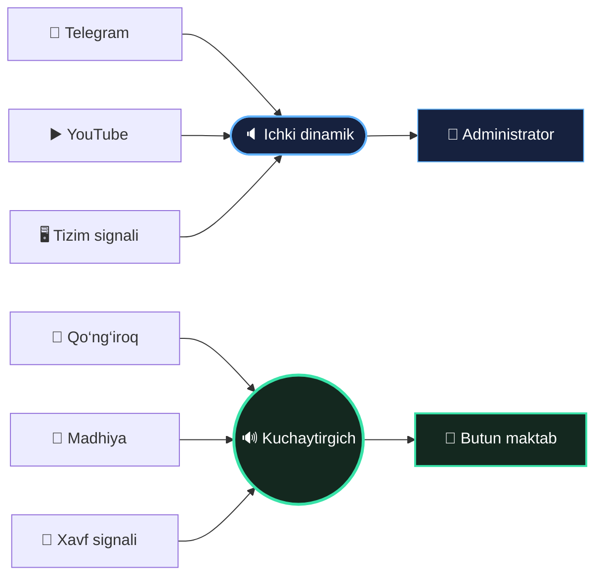
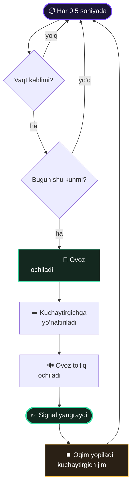
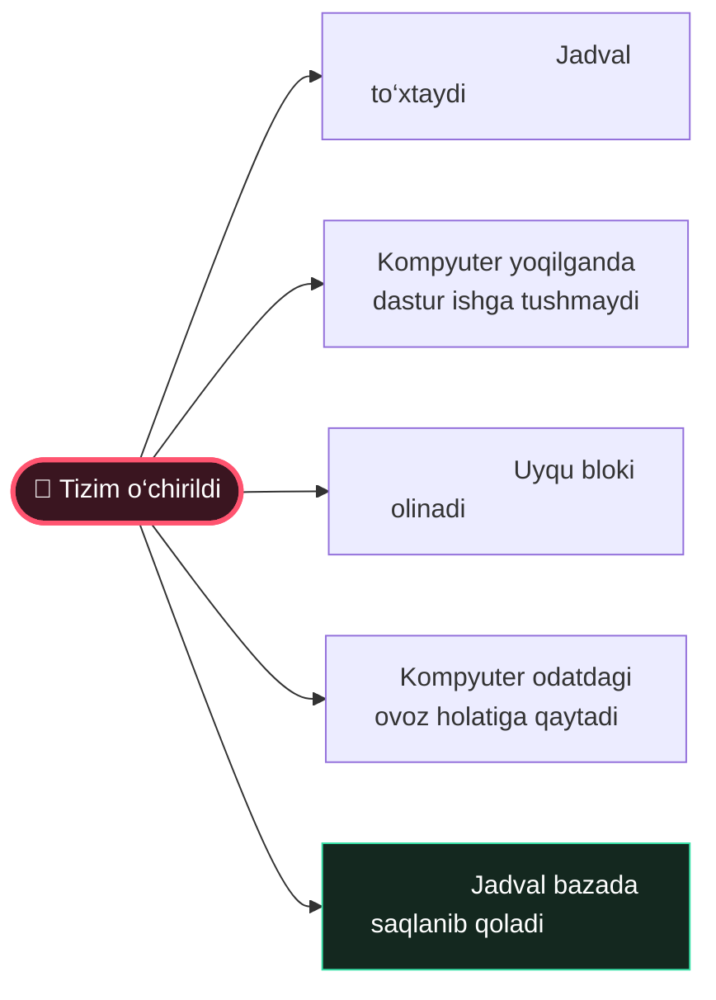

```mermaid
gantt
    title Namuna jadval
    dateFormat HH:mm
    axisFormat %H:%M

    section 1-smena
    1-dars      :done, 08:00, 45m
    2-dars      :done, 08:55, 45m
    3-dars      :done, 09:50, 45m
    Tanaffus    :active, 10:35, 20m
    4-dars      :done, 10:55, 45m

    section 2-smena
    5-dars      :done, 13:00, 45m
    6-dars      :done, 13:55, 45m
    7-dars      :done, 14:50, 45m
```
 

# 🔔 Maktab Qo‘ng‘irog‘i

### Maktab signallarini boshqaruvchi ish stoli dasturi

Jadval bo‘yicha o‘zi chaladi · Kuchaytirgichga faqat o‘z ovozini yuboradi · Kun bo‘yi ishlaydi

 

 

---

## 🎯 Bir qarashda

 

<table width="100%">
<tr>
<td width="25%" align="center">

### ⏰

**Jadval**

Istalgancha vaqt.
Har biriga hafta kunlari
alohida belgilanadi.

</td>
<td width="25%" align="center">

### 🔊

**Aniq manzil**

Signal kuchaytirgichga,
kompyuter ovozi esa
o‘z dinamigida qoladi.

</td>
<td width="25%" align="center">

### 🌙

**To‘xtamaydi**

Uyquni bloklaydi,
qulflangan ekranda ham
o‘z vaqtida chalinadi.

</td>
<td width="25%" align="center">

### 🪶

**Yengil**

Bo‘sh turganda 0,5 %
protsessor, diskka
umuman yozmaydi.

</td>
</tr>
</table>

---

## 🔊 Ovoz qayerga boradi

Kuchaytirgich kompyuterga Bluetooth orqali ulanadi.
Dastur ovoz oqimlarini shunday taqsimlaydi:

 

 

Bluetooth ulanishi hech qachon uzilmaydi — dastur unga tegmaydi,
u operatsion tizimning o‘z ishi.

 

---

## ⚙️ Signal qanday chalinadi

 

 

---

## 📆 Maktab kuni

Jadvalga qo‘yilgan vaqtlar kun davomida shunday taqsimlanadi

 

 

Har bir dars boshi va oxiri — alohida qo‘ng‘iroq.
Hafta kunlari har biriga alohida belgilanadi.

 

---

## 🖥️ Interfeys

 

<table width="100%">
<tr>
<td width="50%" align="center">

### 📋 Jadval

Chap tomonda qo‘ng‘iroqlar ro‘yxati.
Keyingi signalgacha qolgan vaqt doim ko‘rinib turadi.

Har bir qatorni yoqib-o‘chirish mumkin —
o‘chirilgan qo‘ng‘iroq jadvalda qoladi, lekin chalinmaydi.

</td>
<td width="50%" align="center">

### 🕐 Vaqt tanlash

Soat va daqiqa sichqoncha g‘ildiragi bilan aylantiriladi.

Alohida oyna ochilmaydi —
o‘zgarish darhol jadvalda ko‘rinadi.

</td>
</tr>
<tr>
<td width="50%" align="center">

### 🔒 Qulf

Tahrirlash qismi qulflangan turadi.
Administrator qulfni ochib vaqtni o‘zgartiradi.

Boshqa qatorga o‘tilsa eskisi yana qulflanadi.

</td>
<td width="50%" align="center">

### 🎛️ Uchta tugma

**Qo‘ng‘iroq** — o‘z mp3 faylingiz
**Madhiya** — to‘liq yangraydi
**Xavf signali** — takrorlanadi

Bir vaqtda faqat bittasi chalinadi.

</td>
</tr>
</table>

 

Yuqori o‘ng burchakda kuchaytirgich holati, yonida sozlamalar tugmasi.
Sozlamalarda til, kuchaytirgich, ovoz balandligi va tizim tugmasi joylashgan.

 

---

# 🧭 Turli vaziyatlarda

Har bir holat uchun dastur nima qilishini ko‘ring

 

---

## 🕐 Kompyuter soati adashib qolsa

Dastur ikkita soatni solishtirib turadi: **monoton soat** — u hech qachon
orqaga qaytmaydi, va **devor soati** — foydalanuvchi ko‘radigan vaqt.
Ular orasidagi farq katta bo‘lsa, demak soat sakragan.

 

<table width="100%">
<tr>
<th width="50%" align="center">Vaziyat</th>
<th width="50%" align="center">Dastur nima qiladi</th>
</tr>
<tr>
<td align="center">Kompyuter 05:00 dan 11:00 gacha uxladi</td>
<td align="center">Oradagi signallar <b>belgilanadi</b>, chalinmaydi</td>
</tr>
<tr>
<td align="center">Signal vaqtidan 90 soniya o‘tdi</td>
<td align="center">Signal <b>baribir chalinadi</b></td>
</tr>
<tr>
<td align="center">Signal vaqtidan 3 daqiqa o‘tdi</td>
<td align="center"><b>Chalinmaydi</b> — kech qolgan</td>
</tr>
<tr>
<td align="center">Soat orqaga sakradi</td>
<td align="center">Hech narsa qilinmaydi</td>
</tr>
<tr>
<td align="center">Batareya o‘lgan, soat internetdan to‘g‘rilandi</td>
<td align="center">O‘tganlari belgilanadi, keyingilari normal</td>
</tr>
<tr>
<td align="center">Kompyuter 28 kun o‘chiq turgan</td>
<td align="center">Hisob 7 kun bilan cheklanadi</td>
</tr>
</table>

 

Maktabda 3 soat kechikkan qo‘ng‘iroq darsni chalkashtiradi —
shuning uchun o‘tib ketgan signal ataylab chalinmaydi.

 

---

## 😴 Kompyuter uyquga ketsa

Uxlagan kompyuterda vaqt hisoblagichi ham to‘xtaydi.
Shuning uchun tizim yoqilgan bo‘lsa dastur uyquni bloklaydi.

 

<table width="100%">
<tr>
<th width="33%" align="center">Tizim</th>
<th width="34%" align="center">Usul</th>
<th width="33%" align="center">Administrator huquqi</th>
</tr>
<tr>
<td align="center">🐧 &nbsp; Linux</td>
<td align="center"><code>systemd-inhibit</code></td>
<td align="center">kerak emas</td>
</tr>
<tr>
<td align="center">🪟 &nbsp; Windows</td>
<td align="center"><code>SetThreadExecutionState</code></td>
<td align="center">kerak emas</td>
</tr>
<tr>
<td align="center">🍏 &nbsp; macOS</td>
<td align="center">IOKit quvvat tasdiqnomasi</td>
<td align="center">kerak emas</td>
</tr>
</table>

 

Blok tizim o‘chirilganda o‘zi olib tashlanadi.

 

---

## 🔐 Ekran qulflangan bo‘lsa

 

Qulf faqat ekranga tegishli — dastur ishlashda davom etadi.

Sinovdan o‘tkazilgan: seans qulflangan holatda qo‘ng‘iroq
**0 soniya kechikish bilan** chalindi va kuchaytirgichga bordi.

 

---

## 🔴 Tizim o‘chirilsa

Sozlamalardagi tugma butun tizimni to‘xtatadi

 

 

Qayta yoqilganda hammasi tiklanadi — jadval o‘z joyida turadi.

 

---

## 🔁 Dastur qayta ishga tushsa

 

Kompyuter kechqurun o‘chirilib, ertasi kuni yoqilsa —
dastur toza holatda boshlanadi va bugungi o‘tib ketgan
signallarni belgilab qo‘yadi.

Ya‘ni bir qo‘ng‘iroq **ikki marta chalinmaydi**,
o‘tib ketgani esa kech chalinmaydi.

 

---

## 🌐 Uch tilda

 

<table width="100%">
<tr>
<td width="33%" align="center">

# 🇺🇿

**O‘zbek**

standart til

</td>
<td width="34%" align="center">

# 🇬🇧

**English**

to‘liq tarjima

</td>
<td width="33%" align="center">

# 🇷🇺

**Русский**

to‘liq tarjima

</td>
</tr>
</table>

 

Interfeys ham, dastur xabarlari ham tarjima qilingan.
Tanlangan til saqlanadi va keyingi ochilishda tiklanadi.

 

---

## 📥 O‘rnatish

Tayyor fayllar **[Releases](../../releases)** sahifasida

 

<table width="100%">
<tr>
<th width="50%" align="center">Tizim</th>
<th width="50%" align="center">Fayl</th>
</tr>
<tr><td align="center">🪟 &nbsp; <b>Windows</b></td><td align="center"><code>.msi</code> yoki <code>.exe</code></td></tr>
<tr><td align="center">🍏 &nbsp; <b>macOS</b> — Intel va Apple Silicon</td><td align="center"><code>.dmg</code> — universal</td></tr>
<tr><td align="center">🐧 &nbsp; <b>Debian · Ubuntu</b></td><td align="center"><code>.deb</code></td></tr>
<tr><td align="center">🐧 &nbsp; <b>Fedora · openSUSE</b></td><td align="center"><code>.rpm</code></td></tr>
<tr><td align="center">🐧 &nbsp; <b>Boshqa Linux</b></td><td align="center"><code>.AppImage</code></td></tr>
</table>

 

### Birinchi ishga tushirish

 

<table width="100%">
<tr>
<td width="25%" align="center">

# 1️⃣

Kuchaytirgichni kompyuterga
Bluetooth orqali ulang

*operatsion tizim orqali*

</td>
<td width="25%" align="center">

# 2️⃣

Dasturni oching va
⚙ sozlamalardan
kuchaytirgichni tanlang

</td>
<td width="25%" align="center">

# 3️⃣

Qo‘ng‘iroq tugmasidagi
fayl nomini bosib
o‘z mp3‘ingizni yuklang

</td>
<td width="25%" align="center">

# 4️⃣

Jadvalga vaqtlarni qo‘shing
va hafta kunlarini
belgilang

</td>
</tr>
</table>

 

Shundan keyin kompyuter yoqilganda dastur **o‘zi ishga tushadi**.
Administrator huquqi talab qilinmaydi.

 

---

## 📊 Resurs sarfi

Dastur maktab kompyuterida kun bo‘yi ishlaydi — har bir ko‘rsatkich o‘lchandi

 

<table width="100%">
<tr>
<th width="50%" align="center">Ko‘rsatkich</th>
<th width="50%" align="center">Qiymat</th>
</tr>
<tr><td align="center">Protsessor, bo‘sh turganda</td><td align="center"><b>0,5 %</b></td></tr>
<tr><td align="center">Xotira</td><td align="center"><b>~250 MB</b></td></tr>
<tr><td align="center">Diskka yozish, bo‘sh turganda</td><td align="center"><b>0 bayt</b></td></tr>
<tr><td align="center">Ma‘lumotlar bazasi</td><td align="center"><b>24 KB</b></td></tr>
<tr><td align="center">Bir kunlik protsessor vaqti</td><td align="center"><b>~8 daqiqa</b></td></tr>
</table>

 

### Bir kunda protsessor nima bilan band

 

<table width="100%">
<tr>
<th width="34%" align="center">Holat</th>
<th width="33%" align="center">Vaqt</th>
<th width="33%" align="center">Ulush</th>
</tr>
<tr>
<td align="center">Bo‘sh turish</td>
<td align="center">432 soniya</td>
<td align="center"><code>████████░░░░░░░░</code> &nbsp; 0,60 %</td>
</tr>
<tr>
<td align="center">14 ta qo‘ng‘iroq</td>
<td align="center">83 soniya</td>
<td align="center"><code>██░░░░░░░░░░░░░░</code> &nbsp; 0,12 %</td>
</tr>
<tr>
<td align="center"><b>Protsessor bo‘sh</b></td>
<td align="center"><b>71 485 soniya</b></td>
<td align="center"><b>99,30 %</b></td>
</tr>
</table>

 

Jami 515 soniya — 20 soatlik kunning **0,7 %** i.
Qolgan vaqtda protsessor butunlay bo‘sh turadi.

 

---

## 💾 Baza kundan-kunga o‘smaydi

Chalingan qo‘ng‘iroqlar bazaga yozilmaydi.
«Chalindi» belgisi xotirada turadi va har kuni yarim tunda tozalanadi.

 

Ketma-ket uchta qo‘ng‘iroq chaldirib tekshirildi:

 

<table width="100%">
<tr>
<th width="34%" align="center"></th>
<th width="33%" align="center">Chalishdan avval</th>
<th width="33%" align="center">Uch marta chalgach</th>
</tr>
<tr>
<td align="center">Baza hajmi</td>
<td align="center">24 576 bayt</td>
<td align="center"><b>24 576 bayt</b></td>
</tr>
<tr>
<td align="center">Barmoq izi (<code>sha256</code>)</td>
<td align="center"><code>31a77a2711bc99306175</code></td>
<td align="center"><b><code>31a77a2711bc99306175</code></b></td>
</tr>
</table>

 

Barmoq izi bir xil — birorta bayt ham o‘zgarmadi.

Jadval tahrirlanganda qatorlar **joyida yangilanadi**: mavjud qo‘ng‘iroq
vaqti o‘zgarsa yangi yozuv yaratilmaydi. 730 kunlik foydalanish
modellanganda baza o‘sha 24 KB da qoldi.

Jurnal fayllari umuman yozilmaydi.

 

---

## 💻 Platformalar

Jadval, ovoz, interfeys, avtostart va uyqu bloki uch tizimda bir xil ishlaydi.
Ichki usul esa har birida o‘zicha:

 

<table width="100%">
<tr>
<th width="34%" align="center">Tizim</th>
<th width="33%" align="center">Ovoz marshrutlash</th>
<th width="33%" align="center">Uyquni bloklash</th>
</tr>
<tr>
<td align="center">🐧 &nbsp; <b>Linux</b></td>
<td align="center">PipeWire / PulseAudio</td>
<td align="center"><code>systemd-inhibit</code></td>
</tr>
<tr>
<td align="center">🪟 &nbsp; <b>Windows</b></td>
<td align="center"><code>IPolicyConfig</code> + WASAPI</td>
<td align="center"><code>SetThreadExecutionState</code></td>
</tr>
<tr>
<td align="center">🍏 &nbsp; <b>macOS</b></td>
<td align="center">CoreAudio</td>
<td align="center">IOKit</td>
</tr>
</table>

 

Linux‘da ovoz oqimi bir qurilmadan boshqasiga ko‘chiriladi.
Windows va macOS‘da signal to‘g‘ridan-to‘g‘ri kuchaytirgichda ochiladi,
tizimning standart chiqishi esa ichki dinamikda qoladi.

**Natija uchalasida bir xil.**

 

Linux‘da to‘liq sinovdan o‘tgan. Windows va macOS kodi har bir
o‘zgarishda o‘z tizimlarida tekshiriladi, lekin haqiqiy uskunada
hali ishlatilmagan.

  

**Rust · Tauri v2 · SQLite · rodio**

Node.js ishlatilmaydi

 

